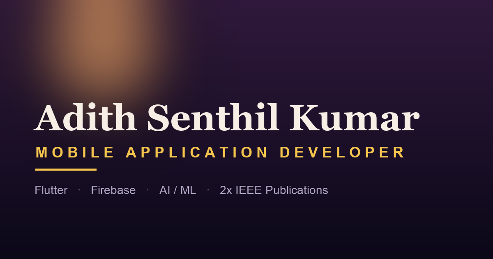
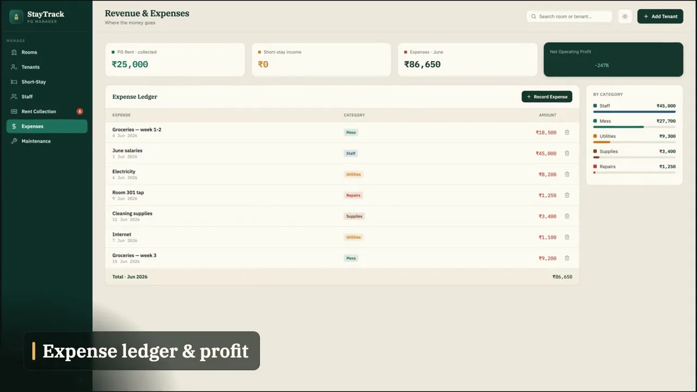
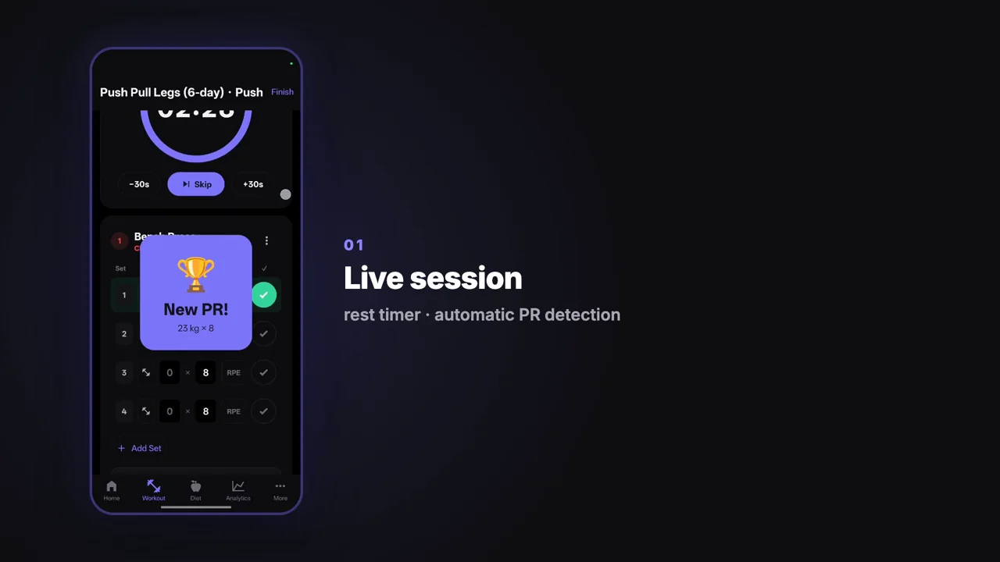
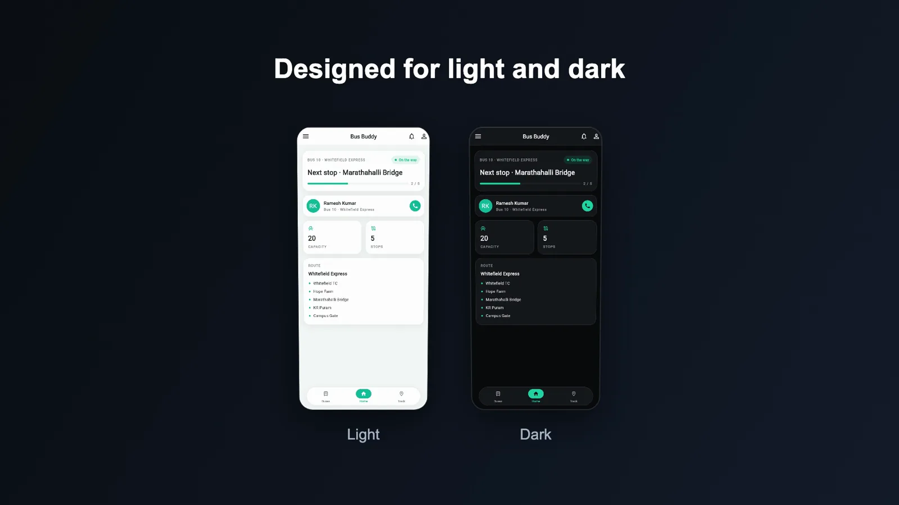
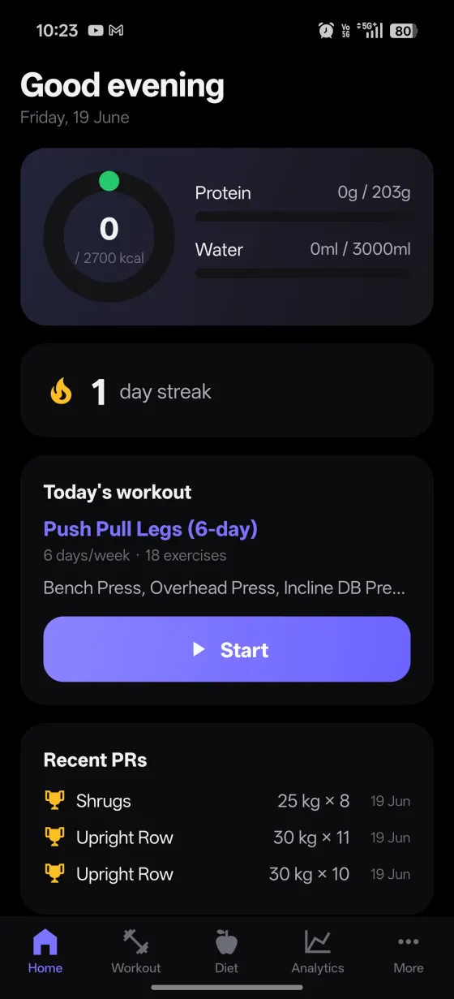
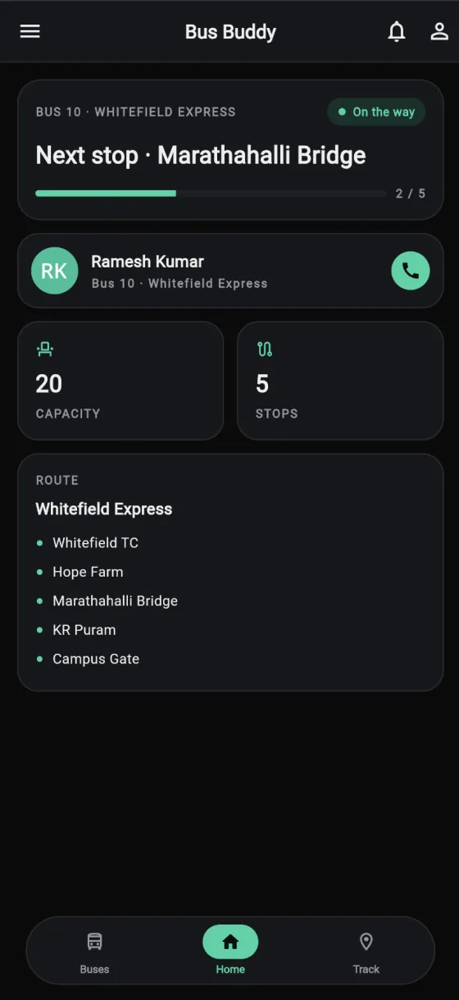
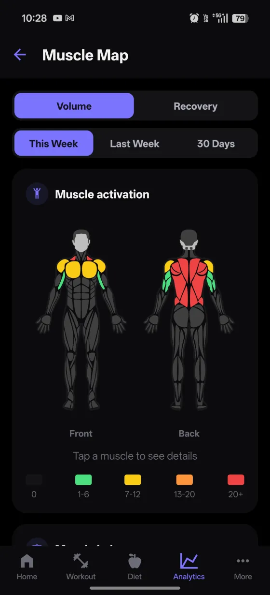
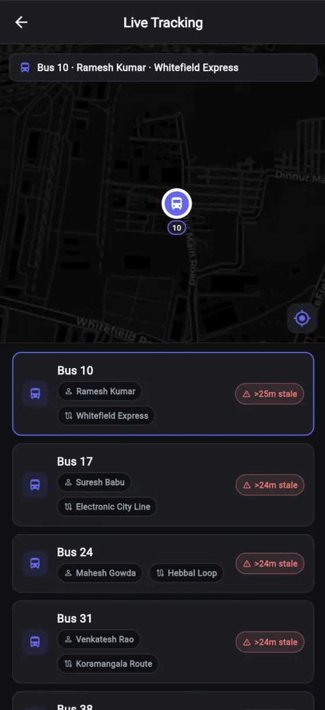

<div align="center">

<a href="https://adith-senthil-kumar.github.io/my-portfolio/">
  
</a>

# Adith Senthil Kumar — Portfolio

**Mobile Application Developer** · Flutter · Firebase · React Native · Expo
Chennai, India · B.E. Computer Science (2026) · 2× IEEE publications

### [🌐&nbsp;&nbsp;Visit the live portfolio&nbsp;→](https://adith-senthil-kumar.github.io/my-portfolio/)

<p>


</p>

</div>

A hand-built personal portfolio — static **HTML / CSS / vanilla JS**, no build step — with a GSAP-animated sunset→night landscape, frosted-glass "dusk" UI, and an installable PWA. Every app gets its own **deep dive**: a written walkthrough, a light/dark screenshot gallery, and a muted-autoplay promo reel.

---

## ✨ Featured builds

<table>
<tr>
<td width="33%" valign="top" align="center">
<a href="https://adith-senthil-kumar.github.io/my-portfolio/staytrack.html"></a>
<h3>StayTrack</h3>
Run an entire PG / hostel from one real-time app — seven modules on an owner-scoped Firestore backend.
<br><br>
<a href="https://adith-senthil-kumar.github.io/my-portfolio/staytrack.html"><b>Deep dive</b></a> · <a href="https://staytrack-ca1ac.web.app"><b>Live demo ↗</b></a>
</td>
<td width="33%" valign="top" align="center">
<a href="https://adith-senthil-kumar.github.io/my-portfolio/gymos.html"></a>
<h3>GymOS</h3>
Offline-first workout &amp; nutrition tracker — no account, no cloud. On-device SQLite via Drizzle.
<br><br>
<a href="https://adith-senthil-kumar.github.io/my-portfolio/gymos.html"><b>Deep dive</b></a>
</td>
<td width="33%" valign="top" align="center">
<a href="https://adith-senthil-kumar.github.io/my-portfolio/busbuddy.html"></a>
<h3>BusBuddy</h3>
One login → three role apps (admin, parent, driver) over a shared Firebase backend with live GPS.
<br><br>
<a href="https://adith-senthil-kumar.github.io/my-portfolio/busbuddy.html"><b>Deep dive</b></a>
</td>
</tr>
</table>

## 📄 Published research

- **SmartHealthLink** — a family-centric health monitor with an AI stacked-ensemble model for hereditary-risk prediction (90.2% accuracy). *IEEE I3CTCON 2026.*
  → [Case study](https://adith-senthil-kumar.github.io/my-portfolio/smarthealthlink.html) · [IEEE Xplore](https://ieeexplore.ieee.org/document/11507141)
- **Cyber Threat Intelligence System** — a real-time CTI pipeline that classifies threat severity with a fine-tuned TinyBERT model (90.2% accuracy). *IEEE CCIC 2026.*
  → [Case study](https://adith-senthil-kumar.github.io/my-portfolio/cyberthreat.html) · [IEEE Xplore](https://ieeexplore.ieee.org/document/11486242)

## 📸 A peek inside

<p align="center">
  
  &nbsp;
  
  &nbsp;
  
  &nbsp;
  
</p>
<p align="center"><i>Every project ships a light/dark screenshot gallery and a promo reel — tap any screen on the live site to open the lightbox.</i></p>

## 🛠 Built with

- **Site** — static HTML, CSS, and vanilla JS, with zero build step or dependencies
- **Motion** — [GSAP](https://gsap.com/) + ScrollTrigger drive the animated sunset→night landscape (SVG art adapted from [isladjan](https://isladjan.com/work/4/))
- **Type** — Fraunces (display), Hanken Grotesk (body), JetBrains Mono (labels); local inline-SVG tech icons
- **Polish** — installable PWA, Open Graph + JSON-LD SEO, fully responsive, `prefers-reduced-motion` aware, and reusable gallery + reel components
- **Apps featured** — Flutter · Firebase · React Native · Expo · TypeScript · SQLite / Drizzle · Python

## 🚀 Run locally

```bash
python3 -m http.server 8000
# then open http://localhost:8000
```

No install, no build — it's a static site.

## 📁 Structure

| Path | What |
|---|---|
| `index.html` | Markup + the inline animated landscape SVG |
| `style.css` | All styles — dusk glassmorphism, responsive |
| `script.js` | Nav, scroll-reveal, scroll-driven parallax |
| `gallery.js` · `reel.js` | Reusable lightbox-gallery + promo-reel controllers |
| `busbuddy.html` · `gymos.html` · `staytrack.html` … | Per-project deep dives & case studies |
| `screenshots/` · `media/` | Optimized WebP galleries + promo reels |
| `icons/` | Per-tech inline SVG logos |
| `papers/` · `adith_resume.pdf` | Hosted IEEE PDFs + résumé |

---

<div align="center">
  <sub>Built with care by <b>Adith Senthil Kumar</b> · <a href="https://adith-senthil-kumar.github.io/my-portfolio/">adith-senthil-kumar.github.io/my-portfolio</a></sub>
</div>
